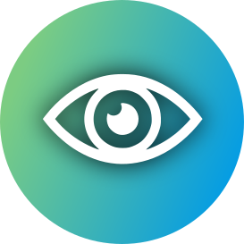

<div align="center">
  <a href="https://github.com/Interactions-HSG/Pupil-Capture-Plugins">
    
  </a>

<h3 align="center">MagicGaze</h3>

  <p align="center">
    Enabling Seamless Control of IoT Devices Through Eye Tracking
  </p>
</div>

<p align="center">
  
</p>

This repository contains the code for the ETRA 2026 Workshop paper:

> **Magic Gaze: Enabling Seamless Control of IoT Devices Through Eye Tracking**
> *Kenan Bektaş, Tobias Ettling, Simon Mayer, and Jannis Strecker-Bischoff. 2026. In 2026 Symposium on Eye Tracking Research and Applications (ETRA ’26), June 01–04, 2026, Marrakesh, Morocco. ACM, New York, NY, USA, 8 pages. [https://doi.org/10.1145/3797246.3804834](https://doi.org/10.1145/3797246.3804834)*

## 📚 Reference
```bibtex
@inproceedings{bektasetalETRA26,
author = {Bekta\c{s}, Kenan and Ettling, Tobias and Mayer, Simon and Strecker-Bischoff, Jannis},
title = {Magic Gaze: Enabling Seamless Control of IoT Devices Through Eye Tracking},
year = {2026},
isbn = {9798400725197},
publisher = {Association for Computing Machinery},
address = {New York, NY, USA},
url = {https://doi.org/10.1145/3797246.3804834},
doi = {10.1145/3797246.3804834},
abstract = {Hands-free control offers natural and intuitive interaction with devices, particularly in scenarios where traditional input methods are impractical. We introduce an extensible framework that integrates eye tracking, object detection, and gesture recognition to study intended and unintended interactions with Internet of Things (IoT) devices. To develop our framework, we conducted a structured experiment with 9 participants, focusing on identifying natural and intuitive interaction behaviors in different situations. The results showed that users intuitively combined gaze- and head-based gestures, showing the potential of head/gaze combinations as input mechanisms, specifically for directional movements. On this basis, we propose a system for hands-free interaction and control of IoT devices with intuitive gaze- and head-based gestures. We report on our promising findings as well as on limitations with respect to accurately distinguishing intention in real-world conditions. All our code1 is publicly available, ensuring the reproducibility and extension of our findings.},
booktitle = {Proceedings of the 2026 Symposium on Eye Tracking Research and Applications},
articleno = {91},
numpages = {8},
location = {
},
series = {ETRA '26}
}
```

## About The Project

This repository contains a collection of plugins for [Pupil Capture](https://docs.pupil-labs.com/core/software/pupil-capture/).
The plugins are written in Python and can be used to extend the functionality of the Pupil Capture software.
We have developed a set of plugins that enable gaze-based control of IoT devices in the network. The plugins are 
integrated with the Pupil Core [Network API](https://docs.pupil-labs.com/core/developer/network-api/).

## Plugins
Currently the following plugins are available:
- [Head Gesture Detection](plugins/gesture-detection/head_gesture_detection.py): Detect head gestures based on triggers. 
Head gestures are head movements while fixating on a object. A gesture is completed when the user moves his head away 
and then back to the defined origin (`norm_pos`) in the trigger event. Currently, the trigger is a fixation event on a object, 
therefor the plugin is dependent on the object detection plugin, but can be switched in code.

- [Fixation Object Detection](plugins/object-detection/gaze_object_detection.py): Predicts the object that the user is
fixating on using a pre-trained object detection model (ultralytics - yolo models).
- [Blink Gesture Detection](plugins/gesture-detection/blink_gesture_detection.py): Detects intentional blinks and associates them with objects in the user's field of view. The plugin distinguishes active (intentional) blinks from passive ones by analyzing the blink duration and gaze context. If a blink event is detected while the user is fixating on an object, it is recorded and can be used as a control signal for interacting with smart devices.
- [Saccade Gesture Detection](plugins/gesture-detection/saccade_gesture_detection.py): Detects saccadic movements and associates them with objects in the user's view. A saccade is registered when the user's gaze quickly moves away from a fixated object and then returns within a short timeframe. The plugin determines the direction of the saccadic movement (e.g., left, right, up, or down) and assigns it to the interacted object.

## Getting Started

To get a local copy up and running follow these simple steps.

### Prerequisites

In order to integrate the plugins with Pupil Capture, you need to install the 
[Pupil](https://github.com/pupil-labs/pupil) software from source and create a dedicated virtual environment for the
pupil software.

To run the plugins you need to install the required dependencies in the virtual environment.

### Adding the Plugins to Pupil Capture

Pupil labs has a [detailed guide](https://docs.pupil-labs.com/core/developer/plugin-api/) on how to add plugins
to Pupil Capture. The plugins can be added by copying the plugin file to the `capture_settings/plugins` directory
located in the Pupil Capture installation directory.

1. Copy the plugin python file to the `capture_settings/plugins` (Arch Linux Installation) directory. Make sure to specify the correct path to the
   Pupil Capture installation directory.
```sh
  cp /path/to/plugin.py /path/to/pupil-capture/capture_settings/plugins
 ```
2. Install the required dependencies in the virtual environment.
```sh
  source /path/to/pupil-env/bin/activate
  pip install -r requirements.txt
 ```
3. Start Pupil Capture and enable the plugin in the plugin manager.
4. The plugin should now be available in the Pupil Capture GUI.

## Usage of the Network API
Explore the example notebooks in the `examples` directory to learn how to interact with the Network API.

## Contributing
*(Feel free to add contribution guidelines here)*

## ✉️ Contact
If you have questions about this research, feel free to contact Kenan Bektaş: [kenan.bektas@unisg.ch](mailto:kenan.bektas@unisg.ch).

This research has been done by the group of Interaction- and Communication-based Systems ([interactions.ics.unisg.ch](https://interactions.ics.unisg.ch)) at the University of St.Gallen ([unisg.ch](https://unisg.ch)).

## 📑 License
The code in this repository is licensed under the Apache License 2.0 (see [LICENSE](https://github.com/Interactions-HSG/GEAR/blob/main/LICENSE)) if not stated differently in the individual files and folders.
